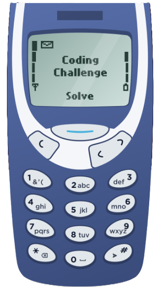

# C\# Coding Challenge
This repository contains some coding challenge done in `C#`.

## .NET
### Version
`8.0.404`
### Scripts
**Build Script**
> `dotnet build`

**Test Script**
> `dotnet test`

## Problems
### Old Phone Keypad
Here is an old phone keypad with alphabetical letters, a backspace key, and a send button. Each button has a number to identify it and pressing a button multiple times will cycle through the letters on it allowing each button to represent more than one letter. For example, pressing `2` once will return `A` but pressing twice in succession will return `B`. You must pause for a second in order to type two characters from the same button after each other: `222 2 22 -> "CAB"`.


#### Prompt
Please design and document a class of method that will turn any input to `OldPhonePad` into the correct output. Assume that a send `#` will always be included at the end of every input.

```c#
public static string input String OldPhonePad( ) {
    // Please write your implementation here!
}
```

#### Examples
```
OldPhonePad("33#") => output: E
OldPhonePad("227*#") => output: B
OldPhonePad("4433555 555666#") => output: HELLO
OldPhonePad("8 88777444666*664#") => output: TURING
```

#### Solution
**Solution Function**
```
Util
    StringUtil.cs
        public static string OldPhonePad(string input)
```

**Test Cases**
```
Util.Tests
    StringUtil_OldPhonePadShould.cs
```